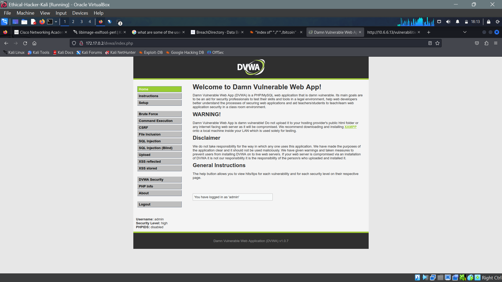
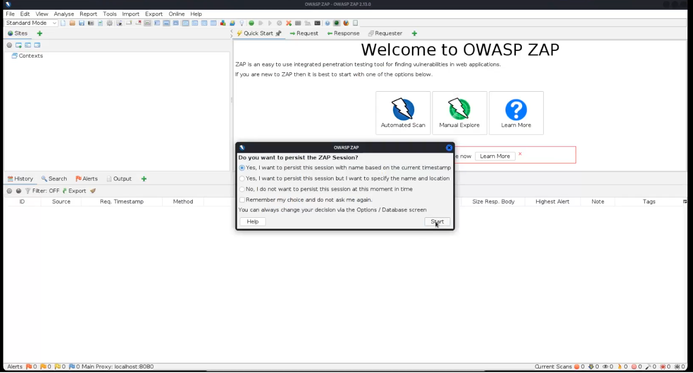
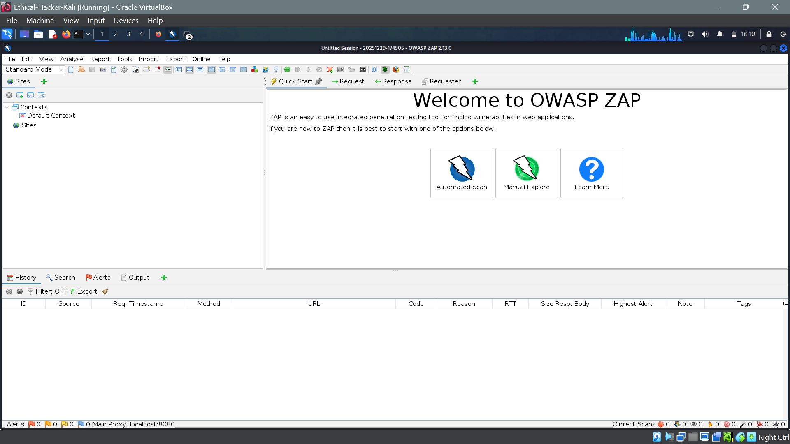
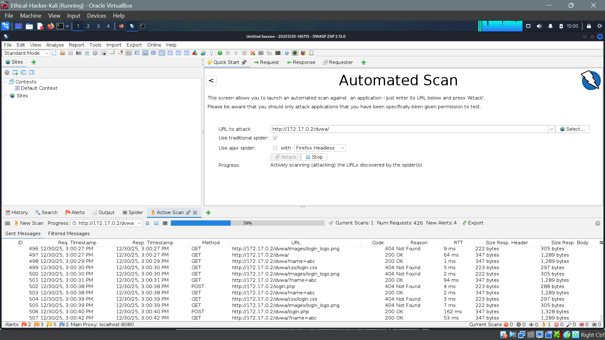
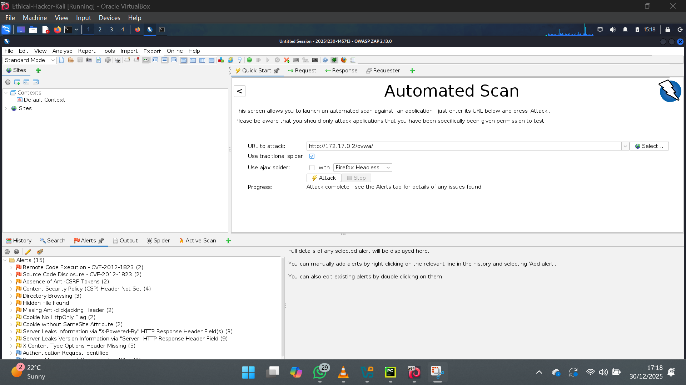

# Website Cloning Lab

## Objective

The objective of this lab was to perform a full web application vulnerability scan using OWASP ZAP in order to identify common security weaknesses in web applications.
The lab focused on understanding the scanning workflow, analyzing detected vulnerabilities, and documenting practical remediation measures.

All testing was conducted in a controlled lab environment for educational and ethical purposes.

### Lab Environment ###

Attacker Machine: Cisco Cybersecurity Virtual Machine

Vulnerability Scanner: OWASP ZAP (Zed Attack Proxy)

Target Application: DVWA (Damn Vulnerable Web Application)

Operating System: Linux (Virtual Machine)

Network Type: Internal / Host-only

### Lab Setup ###

1. Launched the Cisco Cybersecurity Virtual Machine.

2. Started the DVWA web application and confirmed accessibility via browser.

3. Set DVWA security level to High.

4. Launched OWASP ZAP and selected the "Yes I want to persist theis session with name based on the current timestamp" option.

5. Then I continued to select the Automated scan and ran it on the DVWA url.

6. Once the scan completed it returned a summary of all the vulnerabilities it was able to identify on the website and it returned it in a tiered manner that also grades the severity of each vulnerability andf it's associated risk to the system. In my example 15threats were identified in various severities.

### Findings and Observations ###

The scan identified multiple security issues, including:

Cross-Site Scripting (XSS) – Reflected and stored input vulnerabilities

Missing Security Headers – Such as Content Security Policy (CSP)

Cookie Security Issues – Missing HttpOnly and Secure flags

Input Validation Weaknesses – Accepting unsanitized user input

### Security Implications ###

Unaddressed web vulnerabilities can lead to:

1. Credential theft

2. Session hijacking

3. Unauthorized system access

4. Reputational and financial damage

This lab demonstrated how automated scanning tools help detect issues early and support secure development practices.

### Conclusion ###

This assignment strengthened my practical understanding of web application vulnerability assessment using OWASP ZAP.
It reinforced the importance of combining automated scanning, manual analysis, and remediation planning to improve overall web application security.